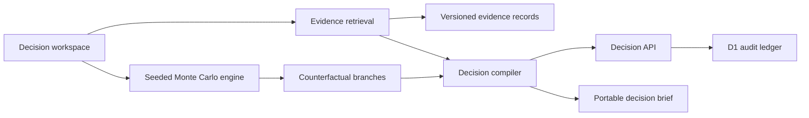

# MORROW / Decision Compiler

[](https://github.com/shauryamalhotra957-wq/morrow-decision-compiler/actions) [](https://opensource.org/licenses/MIT)


> Stop asking AI for answers. Interrogate the future.

Morrow is an evidence-grounded decision intelligence workspace for high-stakes, partially reversible bets. It retrieves the strongest supporting and disconfirming evidence, exposes causal branches, runs deterministic Monte Carlo counterfactuals, and seals every decision into an auditable SQL ledger.

This repository is a production-shaped vertical slice: the interface, retrieval engine, simulation core, API, persistence model, responsive system, tests, and deployment target are implemented. It runs without an LLM key; a model can be added later as a synthesizer without becoming the system of record.

## Why this exists

Most AI assistants optimize for a plausible answer. Strategic decisions need a different contract:

- evidence must remain attributable;
- contradictions must be visible, not averaged away;
- assumptions must be editable;
- uncertainty must be simulated rather than hidden in prose;
- the final action must be reproducible and auditable.

Morrow treats an executive decision as a compiled artifact, not a chat response.

## The product

The included **Project Nightfall** workspace answers a concrete strategic question: should Atlas Mesh launch into the DACH mid-market before Q4?

| Surface | What it does |
| --- | --- |
| Decision Pulse | Compiles the live recommendation and the reversible action boundary. |
| Causal Futures | Compares staged entry, full commitment, and delay as explicit branches. |
| Counterfactual Lab | Re-runs 2,400 seeded simulations as readiness, speed, evidence depth, and risk appetite change. |
| Evidence Ledger | Uses local TF-IDF retrieval, trust weighting, and a disconfirming-evidence bonus to rank source records. |
| Red Team Intercept | Elevates the strongest counter-signal instead of burying it in an average. |
| Audit Ledger | Deduplicates and persists signed decision snapshots in Cloudflare D1. |
| Decision Brief | Exports the assumptions, evidence, and simulation output as portable JSON. |

## Architecture



The key boundary is intentional: retrieval and simulation are deterministic, testable TypeScript. A future LLM may summarize, challenge, or generate hypotheses, but it cannot silently mutate evidence, probability, or the sealed record.

## Technical design

- **Application:** React 19, Next-compatible App Router, TypeScript 5.9
- **Runtime:** vinext on Cloudflare Workers
- **Persistence:** Cloudflare D1 with Drizzle schema and generated SQL migration
- **Retrieval:** interpretable TF-IDF scoring with trust and stance calibration
- **Simulation:** seeded Monte Carlo model with probabilistic shocks and percentile envelopes
- **Testing:** Node's native test runner, deterministic unit tests, production worker SSR contract tests
- **Accessibility:** semantic controls, visible focus, keyboard evidence search (`⌘/Ctrl + K`), reduced-motion support
- **Responsive system:** dense desktop war room, single-column tablet mode, compact mobile command surface

## Run locally

Requirements: Node.js 22.13 or newer and npm.

```bash
npm ci
npm run dev
```

Open `http://localhost:3000`.

The local runtime provisions the `DB` binding declared in `.openai/hosting.json`. The API defensively creates its table and index on first use, while the checked-in migration remains the deployment source of truth.

## Quality gates

```bash
npm run test:unit   # retrieval and simulation behavior
npm run lint        # static analysis
npm test            # production build + every test
```

The simulation suite verifies reproducibility and directional correctness. The worker suite renders the production bundle and asserts that product content and social metadata ship without starter artifacts.

## Decision API

### `POST /api/decisions`

Persists an immutable decision snapshot. Equivalent snapshots are deduplicated by SHA-256 fingerprint.

```json
{
  "title": "Project Nightfall — DACH entry",
  "question": "Should we launch Atlas Mesh into the DACH mid-market before Q4?",
  "recommendation": "STAGE",
  "confidence": 84,
  "scenario": {
    "inputs": {
      "readiness": 78,
      "speed": 68,
      "evidenceDepth": 83,
      "riskAppetite": 57
    }
  }
}
```

Validation constrains text lengths, recommendation values, confidence range, and total scenario size.

### `GET /api/decisions`

Returns the 20 most recent ledger entries without returning their full scenario payload.

## Repository map

```text
app/
  api/decisions/route.ts        validated persistence boundary
  components/DecisionWorkspace.tsx
  globals.css                   complete visual and responsive system
db/
  index.ts                      D1 access and idempotent schema guard
  schema.ts                     relational source of truth
drizzle/                        generated deployment migration
lib/
  decision-engine.ts            retrieval + counterfactual simulation
tests/
  decision-engine.test.ts       deterministic model tests
  rendered-html.test.mjs        production SSR contract tests
worker/index.ts                 Cloudflare Worker entry point
```

## Security and trust model

- The API accepts only a narrow, size-limited JSON contract.
- Decision fingerprints make retries idempotent and reveal accidental duplicates.
- Full scenarios remain server-side; list responses expose only summary fields.
- Retrieval never executes source content or lets it modify system behavior.
- Source trust and stance are explicit fields, not hidden prompt instructions.
- The simulation is deterministic for the same inputs and seed, enabling exact review.

For a multi-tenant production rollout, add identity-aware ownership, row-level authorization, signed evidence ingestion, and retention controls before accepting customer data.

## Research thesis

Morrow's shape follows a converging body of evidence: enterprise RAG is now evaluated against noisy, conflicting multi-source corpora; agent reliability remains a distinct problem from capability; and causal methods are increasingly central to trustworthy AI. See [EnterpriseRAG-Bench](https://arxiv.org/abs/2605.05253), [TheAgentCompany](https://proceedings.neurips.cc/paper_files/paper/2025/hash/0d744742f6fac4d1134c019b7cef3c8a-Abstract-Datasets_and_Benchmarks_Track.html), the [KDD survey of LLM-agent evaluation](https://doi.org/10.1145/3711896.3736570), and the [OWASP RAG Security Cheat Sheet](https://cheatsheetseries.owasp.org/cheatsheets/RAG_Security_Cheat_Sheet.html).

## License

MIT — see [LICENSE](./LICENSE).

## API safety notes

Decision ledger failures return stable public errors. Evidence limits are bounded, and simulation controls normalize non-finite or out-of-range values before modeling so persisted outputs remain finite and reproducible. See the API and retrieval boundary tests for examples.